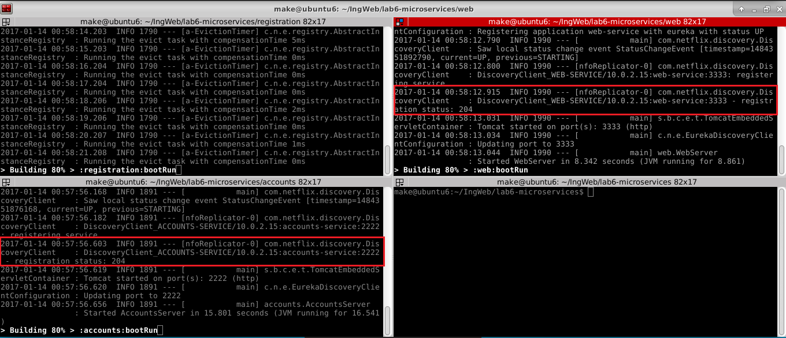
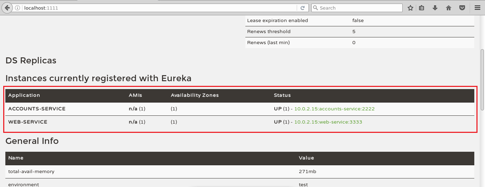
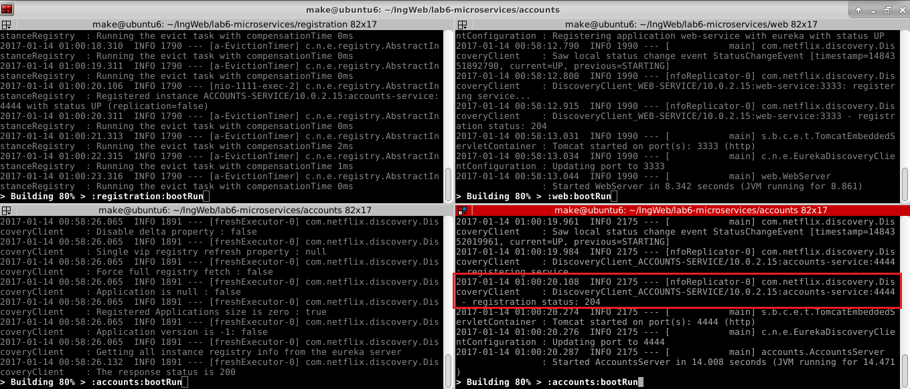
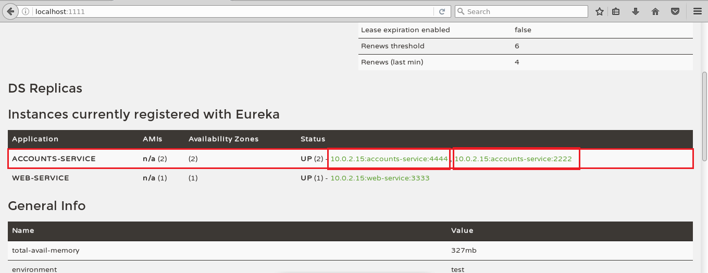

## The two microservices (account & web) are running and registered

## The service registration service has the two microservices (account & web) registered

## A second account microservice is running in the port 4444 and it is registered

## Brief report describing what happens when you kill the microservice with port 2222
The account service registered on port 4444 assumes the control.
The change is completely transparent to the end user.
That is, there is no feedback about the replacement.

#### Can the web service provide information about the accounts?
Yes!
#### Why?
Because there is still an account service registered on port 4444
